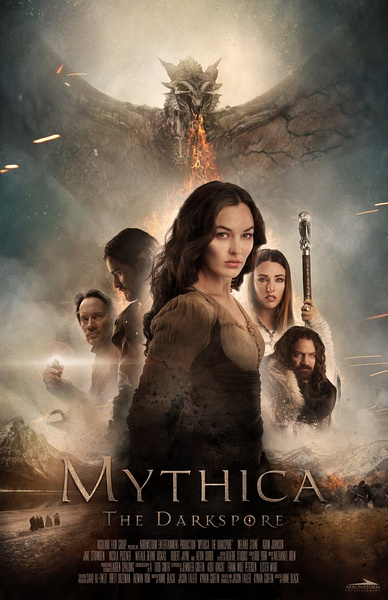
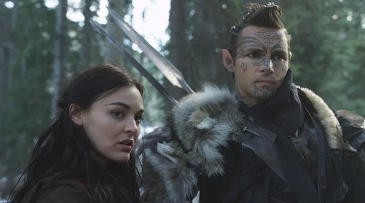
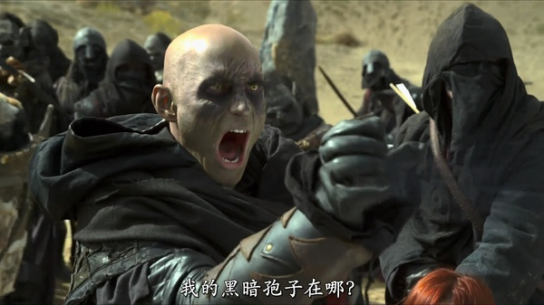

《麦斯卡：黑暗孢子 Mythica: The Darkspore》

			

老公的评论：
 

　　对于这种魔幻片，其实更重要的不是故事情节了，而是对那种纯粹的西式古典文化的认知和了解——其实这么说很无奈的，因为这部电影很难被看懂……
 

　　电影总是要有冲突、有结果的，这部电影真的很游戏化，小冲突不断，大冲突没有，而结果更是不知所云——，系列电影不是不能有关联，但至少应该独立成篇吧，这部电影这点很诡异，如果不联系前作——比如我，根本不知道这个故事是如何开始的，更不知道它要如何结束。
 

　　魔幻片的特效什么的总是很容易被人诟病，其实这个是见仁见智的，古今中外那么多法师，做法的时候也不见得有多绚烂，大家还是信了，我到觉得重要的是通过视觉效果表达出了要表达的意思——我们怎么知道魔法是什么样子呢？还是我们已经认为了动画片中的魔法效果才是真正的魔法效果……
 

　　剑与魔法，其实也是一个永恒的话题，这样的影视作品永远不会消失——只是我们都有各自的审美观——对于这部电影的再续，我看还是放弃的好，哈哈！
 
　　在《麦斯卡：黑暗孢子》之前，被我们弃片的电影是《我的吸血鬼老板》。

老婆的评论：
 

　　梅里克他们四个还将继续自己的征程，不让巫妖王的心脏合并，带来黑暗力量。看这部电影时，我觉得最精彩的部分没有看到，他们如何去面对黑暗势力，有点遗憾，今天早上听老公说，这原来是系列剧，所以，故事仍会继续，请看下一集。哈！
 

　　当然结果，我已经可以想象了，邪不胜正嘛，梅里克必赢，在面对困难时，能克服自己本能，不使用黑魔法，这个人心性很坚韧很勇敢。
 

　　相对来说，这部电影应该算小成本电影了，没有大场面，没有巨星，特效也不多，剧情也很幼稚，听说电影是由一个游戏改编的，黑龙守着的金矿，有点像游戏英雄无敌里面的场景。
 
　　对我而言，魔幻世界是一个特殊的存在，所以，剧情幼稚点没有关系，也不会影响我。
 
　　我有点好奇，为什么黑暗精灵不能被治疗，因为他不是主角？　

 
上映年份　2015							
		
http://blog.sina.com.cn/s/blog_52187ba90102w67o.html
