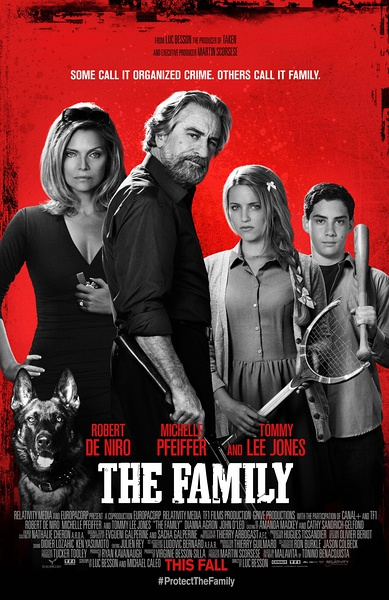
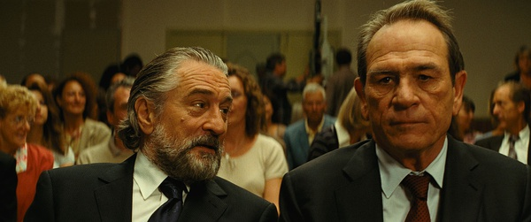
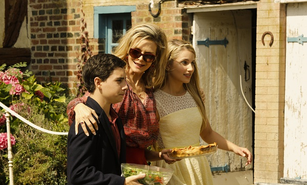

《黑帮家族 Malavita The Family》

			

老公的评论：
 
　　很黑色的幽默喜剧。
 

　　我一直没搞懂为什么主人公在逃亡期间还要不停地打杀身边的人，而且是因为一些不起眼的小事情，哈哈，躲让FBI们费心啊，还好最后有个大枪战，要不然花园里的尸体被挖出来，可就有问题了。
 

　　这部电影拍的很像是漫画，小姐弟俩的暴力与能力连漫画里的主人公恐怕都很难做到。到家中的妈妈有一些前后不统一，开始随随便便就炸了一家超市，后来却连拿起枪来自卫的勇气都不够，不如她的孩子们。
 

　　如果把这部电影当做一个什么题材来分析的话，我觉得就浪费了，因为这就是一部搞笑的喜剧，只是背上了一个黑帮的背景，其实这个故事不是黑帮家族也一样有趣。
 

　　看到一些评论把这部电影和《好家伙》相比，我觉得完全不是一种风格，这部电影可能过一段就会忘了，但是我永远不会忘记看《好家伙》给我带来的震撼，直到现在，一些场景还牢牢地印刻在我的脑子里，让我知道什么才是真正的“狠”。

老婆的评论：
 
　　与这样的家庭做邻居会不会太危险？
 

　　主人公（罗伯特·德尼罗饰），曾经是黑帮一员扳倒了黑帮老大，正接受证人保护计划，2000万美元是黑帮出杀他的价格，正因为他太值钱，所以太多杀手要来杀他，他们家每90天就得搬家一次。
 

　　他们避到法国的小镇，开始新的生活，可过去的生活总会在你身上刻上烙印，不知觉的会流露出来，比如主人公把水管工揍到残疾，把自来熟老板给折腾的说真话，当然也解决了水的问题，妻子就把超市给炸了，女儿就会揍有色胆的男同学，儿子在受到欺负后开始反击。
 
　　在无数的巧合下，黑帮老大还是知道他们的位置了，派出大批杀手过来，这场对决中，妻子显得逊点，没有炸超市的狠劲。
 
　　这下，他们又要换一个新的地方了。他们家院子里的尸体怎么办？
 
　　整体来说，这部电影很好看。

上映年份 2013							
		
http://blog.sina.com.cn/s/blog_52187ba90101hsa1.html
