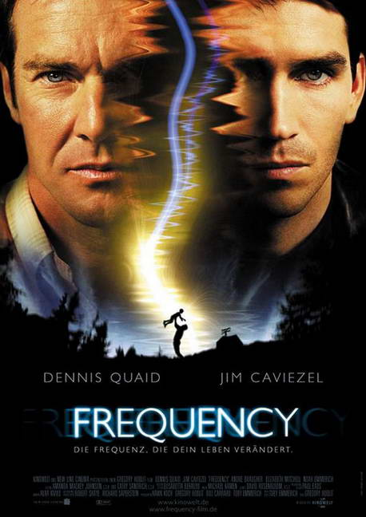

《黑洞频率 Frequency》

			【夫妻影评】《黑洞频率 Frequency》

老公的评论：
 
　　很久以前的老电影，在影片开始之前我还骗老婆大人说这是港产老片，是刘德华和梁朝伟早期合作的作品，嘿嘿！
 

　　这是一部值得回味的老电影，虽然电视台已经播放过很多次了，但因为种种原因，我一直没有看全过，剧情我基本都清楚，但就是想再让这些演员演绎一次。
 
　　那个时候的电影，没有夸张的画面效果与声响，但故事却安排的很精致，小队长与父亲、母亲的那份亲情会让大多数人觉得感动。
 

　　在这部电影之中，提到了穿越时空的因果律，就是我们经常说的蝴蝶效应，不过这只蝴蝶折断了翅膀，却没有引起飓风，而只是让一个变态连环杀手逍遥法外了。
 

　　我很喜欢这样结尾，我不喜欢为了制造二制造的悲剧，主人公的第一次改变历史救了父亲，却失去了母亲，在他修正自己错误的时候，虽然没有在第一时间杀掉连环杀手，却让父亲成功地戒了烟，也让自己的爱人回到了身边，影片最后的那场棒球真的很温馨。我真的想不出有什么人不想生活在这样的家庭环境之中。
 
　　在电影的背景声音之中，一直不停的讲述着有关时空的一些科学假说，在那个年代——太震撼了！
 
　　没看过这部电影的科幻迷一定要补这一课！

老婆的评论：
 
　　这是一部非常温馨的科幻影片，故事的结局很让人喜欢。
 

　　电影中的儿子约翰（是一个警察）通过无线电与30年前的父亲法兰（是一个消防员）联系上了，在约翰的历史里，父亲应该就要在联系的第二天去世的，正因为约翰的警告，父亲的命运没有在第二天的火灾中去世，历史改变了，约翰的世界也改变了。
 

　　整个故事简单，拍摄手法也没有什么特别的地方，淡淡的讲述这对父子通过对话来解决他们改变历史的不好影响，一些简单的对话，事件处理就把整个故事完整的显现出来了，有一个场景让人挺深刻的，就是法兰把钱包放进窗台地下而约翰隔着30年的今天马上就能拿到，感觉很神奇。
 

　　最近看美剧多了，熟脸孔也多了，在电影的刚开始时，我看见一个消费队员很像最近看过的一部电视剧《妙女警探》中的女侦探Jane的弟弟，再一个镜头时，我已经相当的确定是他了，告诉老公，他觉得很难是，因为这两部影片拍摄时间差有10之久了，感觉他长相一点都没有变化，很可怕啊！不过，最后老公还是确定这的确是同一人。
 
　　有一种感觉，这部影片多年看过，哈哈！
 
 
上映时间2000
 
导演
Gregory Hoblit
格利高里·赫利特
 
编剧
Toby Emmerich
 
主演Frank……Dennis
Quaid
弗兰克……丹尼斯·奎德
John……James Caviezel
约翰……詹姆斯·卡维泽							
		
http://blog.sina.com.cn/s/blog_52187ba90100olm5.html
