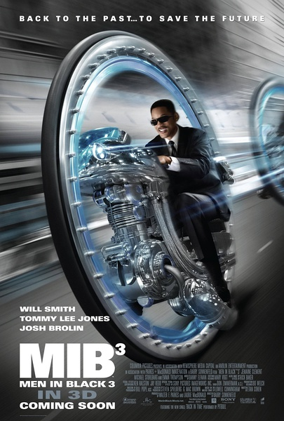
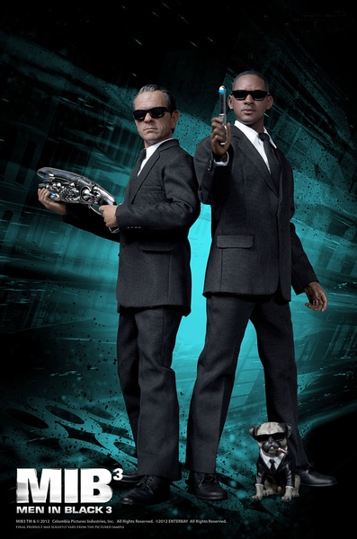

《黑衣人3 Men in Black III》

			

老公的评论
 

　　开始的时候，对这部电影有点失望，毕竟探员间的冷幽默，以及中餐馆的枪战都显得有些老旧了，但是，一切的开始原来是从穿越开始的，穿越，和
Griffin那些可爱的理论，让这部电影在我的眼中增色许多。
 

　　一个事物的发展结果并非唯一的，而是由不同概率可能组成的组合，这点很有意思，而且，任何一个看似不相干的事件都有可能对很远处的事物产生致命的影响——电影最后探员K是否付了小费将影响一颗小行星（陨石）是否撞击地球，这是对“蝴蝶效应”最画面感的解释。
 

　　Griffin是一个属于多维空间的生命，电影中是五维，这是一种很有趣的尝试，到底我们看到的多维生物是什么样子的？或者当我们看着自己的影子——这个二维存在的“东西”的时候，是否思考过二维生物——如果存在的话，是如何看我们这些三维生物呢？
 
　　空间用三个维度来描述，加上时间这一维度，这还是比较好理解的，那么第五个维度呢？显然这是有趣的话题。
 

　　看《黑衣人》其实一个乐趣是看那些古怪的生物，这在第三部续集里让我有些失望，但是电影中一些属于真正科幻的内涵让我这个科幻迷很是喜爱！
 
　　感觉这个电影可以以剧集的形式推出的，期待！

老婆的评论：
 
　　最近看的电影感觉上都还可以，这部电影虽说没有那么精彩，但可看。
 

　　相对前两部来说，这一部就少了感观上的精彩，少了很多外星生物的参与，故事更多是围绕穿越这一题材，是黑衣人J忽然发现自己搭档K消失了，而周围同事有的根本就没有K的记忆，有的就认为K在40年前就死了，看的时候我就奇怪为什么J有K的记忆呢？不管怎么样，J要赶到40年前鲍里斯回去的前一天，消灭鲍里斯，解救J。
 

　　在40年前，K和J遇到了外星人格里芬，我觉得这个角色还有点意思，与搭档J不仅解决了鲍里斯，还在阿波罗上登月前把A网装在了火箭上，这个可以保护地球免受外星人的侵略，而K最终还了解到自己父亲的故事，算是一个美满的结局。
 
　　不过，当K回到现在时，这一切似乎都没有发生过，J还在那个小餐厅吃饭，而格里芬在边上，只是大家都没有注意他而言。
 
上映年份 2012							
		
http://blog.sina.com.cn/s/blog_52187ba9010193h4.html
