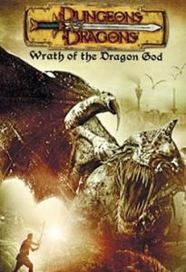
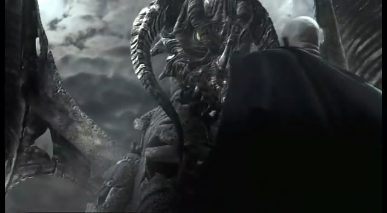
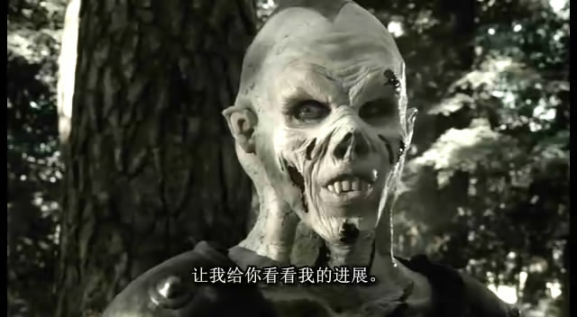

《龙与地下城》

			【夫妻影评】《龙与地下城 Dungeons & Dragons
2: Wrath of the Dragon God》

老公的评论：
 

　　找这个电影看的时候，我就知道老婆大人一定非常喜欢，所以，我也非常喜欢，可惜的是没找到第一部，不过也好，第二部肯定会更炫一些。
 

　　我们俩个都没有玩过《龙与地下城》这个游戏，因此也没有什么先入为主的偏见，但是我和老婆大人比较爱玩的游戏是魔法门英雄无敌还有魔兽的一个地图DOTA，因为这两个游戏，我们在这部电影中找到了熟悉的感觉。
 

　　一个老伙计是巫妖，DOTA里的一个英雄，法系里算是杀人能力比较强的，另一个则是冰龙，在英雄无敌3里面出现过，老婆每次看到有关古代魔法的电影电视剧都很高兴，这次但让也不例外了。
 

　　战士、女战士、牧师、魔法师、盗贼，这样的组合真的很像是游戏的里的组合，在这个电影之中到也不觉得唐突，只不过把王国的军队描写的太弱了一些。而且，最后的黑龙和想象中的黑龙有很大的不同，太凌乱了。
 
　　看过之后，老婆大人觉得意犹未尽，看来有机会还是要把第一部找来看看的。
 

老婆的评论：
 

　　早上与老公讨论这部影片，老公说中世纪的电影是“剑与魔法”的电影，这种说法真的很有道理。本片很好的诠释了这一点，当然还有主人公的那种能战胜一切的“信念”。就靠这种“信念”正义一方才能战胜黑暗的Damodars。
 

　　大概是因为我太喜欢看中世纪的电影吧，对这部电影我的评价挺高的。看影片本身来看，电影情节，电影主线，电影的风格还有塑造的这些人物形象，我似乎都无法挑出什么毛病。
 

　　在看电影之前并不知道有龙与地下城的游戏，只是觉得电影中的冰龙很像魔兽里的冰龙，巫妖也挺像冰封王座里的巫妖，还有那颗真视宝石，这些让我对这部电影更加的熟悉。
 
　　至于故事的情节，我想不要过多的在这里评论了。如果喜欢中世界影片的朋友，值得去看看。
 

上映年份2005
 
导演Gerry Lively
 
主要演员Berek ……Mark
Dymond
Lux……Ellie Chidzey
Nim……Tim Stern
Ormaline……Lucy Gaskell							
		
http://blog.sina.com.cn/s/blog_52187ba90100kjm8.html
