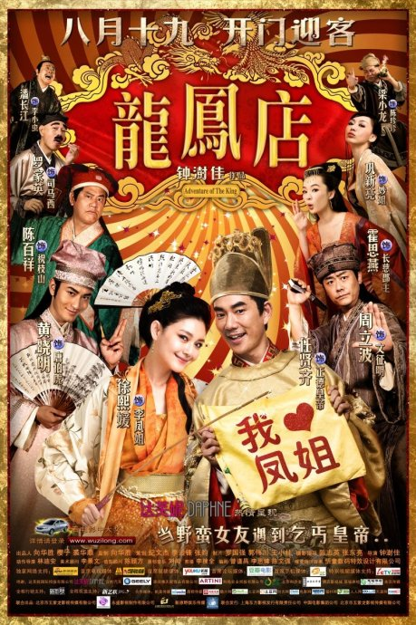
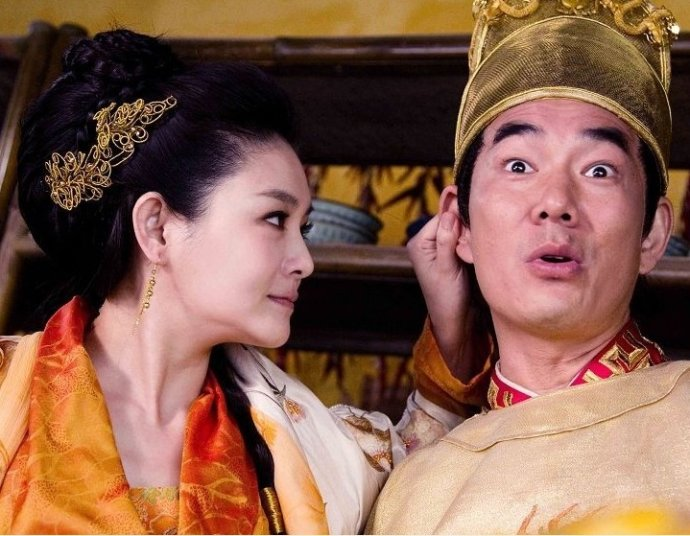

《龙凤店》

			【夫妻影评】《龙凤店》

老公的评论：
 
　　在看《唐伯虎点秋香2》结尾的时候，看到了《龙凤店》的凤姐，所以，当然也要找来看看了！
 

　　个人感觉，《龙凤店》要比《唐伯虎点秋香2》拍的更精致一些，里面虽然也有很多恶搞的成分，但整个故事有起有伏，让人可以去想象一些什么。
 
　　任贤齐拍的电影，大多数还是很可看的，这次他扮演的正德皇帝就很有看点，虽然威严稍差了一些，但很生活化、平民化。
 
　　大S，我看她的影视作品不多，这次看，觉得她的脸盘有点大，呵呵！
 

　　感觉这部电影应该再长一些，因为里面有很多内容似乎没有交代清楚，比如祝枝山冒充皇帝的后果，比如王明阳到底是怎么回事，比如公主怎么话就变少了……
 
　　在没看结尾之前，我真的没想到这是一部讲古代政治斗争的电影，这点我觉得电影处理的很好。
 

　　老婆大人觉得罗家英扮演的史官有点夸张，她不了解古代的史官确实是基本这个样子的，我打赌他们一定是这样………………，除非……不是！
 
　　很轻松好笑的电影，最后的结尾也很喜剧，让人看着很放松。
 

老婆的评论：
 

　　老公说这部影片比《唐伯虎点秋香2》好看，也更搞笑一些，也是，至少这里有好些镜头让人感觉很好笑。史官司马西（罗家英饰）这个角色很有意思，他要真能这么记载历史，脑袋不知道要掉多少次。
 

　　关于李凤姐（大S饰）与正德皇帝（任贤齐饰）的故事，在《四大才子》中看过，老公说这段野史有很多的版本，不管怎么样，这里有多了一种，这些反正也无关痛痒，看个热闹吧。不过，这里的皇帝并不像历史上说的那么昏晕，还挺有智慧的。
 

　　为了对付要造反的宁王，正德皇帝溜出宫去，在途中经历各种，最后流落到凤姐的龙凤店，在这里皇帝装失忆，有了李小龙的名字，上演了一场场热闹的故事，皇帝也爱上了凤姐，最终把凤姐带回了皇宫。
 
　　大S演这种泼辣的女子还挺适合她的，不用笑，脸一沉就可以了。
 
　　很奇怪这部影片怎么与《唐伯虎点秋香2》串一起了呢？现在的电影都不介意互相渗透？都讲究你中有我，我中有你啦？
 
上映年份
2010							
		
http://blog.sina.com.cn/s/blog_52187ba90100orw7.html
