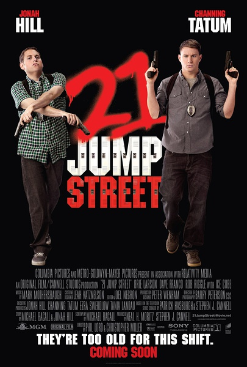
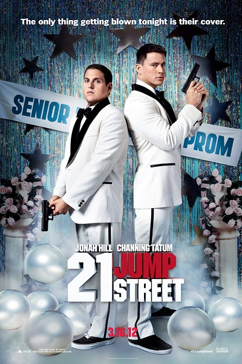

《龙虎少年队 21 Jump Street》

			

老公的评论：
 

　　我没看过那部老版的电视剧，也对约翰尼·德普的兴趣不大，所以我是没有带着任何情结来看这部电影的，总的感觉是有点老旧，有点搞笑。
 
　　不过话说回来，如果能回到高中的年代，有谁会不愿意呢，怀念十三中，怀念那一帮如今已经各奔东西的兄弟。
 

　　准确地说，这部片子已经不是搞笑了，而是有点恶搞，而且脏话很多，本来不该是我喜欢的文艺作品，不过两位主演在一些细节上的处理还是显得很地道的，让我又觉得这是一部下了很大功夫的电影。
 
　　开始以为是个小成本，后来看了资料，居然高速公路就封了一个星期，真是难以想象，不知道这部电影的票房如何？
 
　　无论怎么说，能让我们看完，说明就有我们喜欢的地方，如果你喜欢闹剧的话，不妨试试。
 

　　另外刚好在接下来的一部电影我们选择了《制胜一击》，居然又有查宁·塔图姆，挺有意思的，可惜《制胜一击》不够精彩，看了一会儿，我们就放弃了。
 
　　当听说这部电影有位编剧也是主演的时候，觉得就应该是小胖子，果然是乔纳·希尔，呵呵，他长得就像个编剧。

老婆的评论：
 

　　看的时候总觉得这部影片是一个小成本的电影，后来老公查过了并不是，但是拍摄的方式总好像差点意思，整部电影的感觉也差点意思。
 

　　施密特和延科都没参加成高中舞会，一个是因为成绩太差，一个是因为对着自己想约的女伴说不出来，7年后一起在考警察，一个成绩太差，一个体能太差，在互相的帮助下，他们一起当上了警察并成为搭档，刚执行任务就遇到一群毒贩，结果把证据给弄丢了，太逗了吧！于是派去当卧底，这既是最笨的卧底也是最搞笑的两人组。
 

　　回到高中生活里，这二人又一次面对7年前的问题，不过这次他们都克服了，并在阴差阳错下抓住了坏蛋，其实，从剧情来看并没有什么特别的，要看的就是这两人如何的耍宝了。要是卧底都如这两个活宝这样，那坏蛋也特笨了吧，这样的坏蛋我想不用打击都会自投罗网的。
上映年份：2012
主演
乔纳·希尔/Jonah Hill
查宁·塔图姆/Channing Tatum							
		
http://blog.sina.com.cn/s/blog_52187ba90101290m.html
