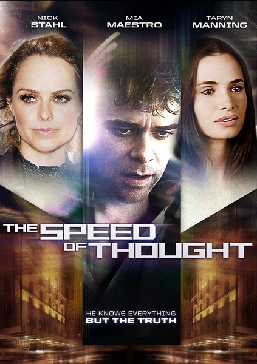

片】《未来时速The Speed of Thought》

			

老公的评论：

　　网上都用这个译名，但我却很困惑，哪位大侠可以解释解释，这个电影的中文名字和英文名字到底有什么关联？另一个译名《思绪的速度》也很有意思，像是在说相声。
 

　　这部电影讲的是读心术与读心人的。感觉上不像是一部大成本的电影，不过立意却还有些可取之处，美国政府利用一些可以进入他人思维的特异功能者去为政府工作，这些人中的一员最终发现了事情的真相，为了爱情放弃了所有，哦，不对，是两个读心人为了爱情，共同放弃了其他的一切。
 

　　整部片子有一种淡淡的感觉，看的时候我一直觉得这部片子那种淡淡的味道很有些像《时光旅行者的妻子》，虽然没有什么大场面，但是可以让人有所感触，却又不会显得很复杂，让人要费力去思考。这样的电影，一个人看可能没什么意思，但是和老婆大人一起，还是可以边聊边看的。
 
　　我觉得这是我看过的影视作品之中，把特异功能者描述的最像正常人的一部。
 
　　很羡慕主人公在赌场上所做的一切，很有意思，会读心术的话，赌钱真的就很难输了，要修炼！
 

 
老婆的评论：
 
　　我和老公都不明白影片的名字为什么叫未来时速？怎么的都有点怪异！
 

　　这部影片给我两个感觉，第一和《盗梦空间》感觉很像。第二是整部影片都是淡淡的在进行，就连最激烈的那部分，但是给人淡淡的感觉。
 

　　俱有约书亚这样的特殊能力真的很好，我和老公设计好了，如果我们俩有这种能力的话，就在街边摆一个乞讨式的小摊，让过来的人就把钱都扔过来，哈哈！没追求吧？！
 

　　其实政府控制这些特殊人群没有问题，用他们去办事也没有问题，但因为怕他们28岁后本领变强了，所以就要给他们一种病毒让他们不能正常的过完28岁，似乎让人很难接受。
 

　　还好在约书亚遇到了安娜，爱情给了这个年轻人憧憬未来的希望，正是这种希望，他终于要摆脱现在的一切，可惜在机场他没能同时控制住两个来抓的人。还好，结局是我喜欢的……

上映年份：2011年
　
导演
Evan Oppenheimer
主演
Joshua……Nick Stahl
Anna……Mía Maestro
Kira……Taryn Manning							
		
http://blog.sina.com.cn/s/blog_52187ba90100yp19.html
